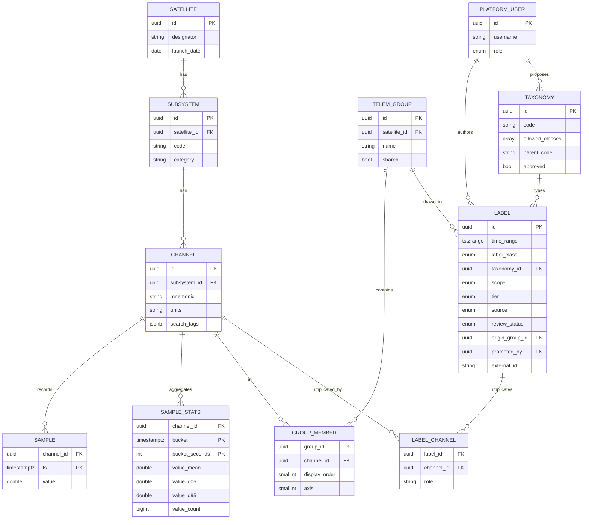
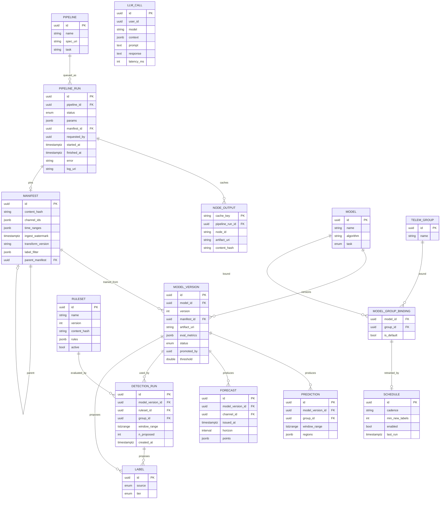

# Entity relationship diagrams

One Postgres database per **program**. Five schemas, three owners.

| Schema | Owned by | Migrations |
|--------|----------|-----------|
| `catalog`, `telemetry` | `satellite-telemetry-db` | 001–004 |
| `app`, `labels`, `ml` | `satellite-telemetry-platform` | 010+ |
| `public` | MLflow (auto-created) | — |

`satellite-telemetry-mlflow` migrates nothing. It reads `catalog` /
`telemetry` / `labels` and writes rows into `ml.*`.

Foreign keys cross **one way only**: platform → catalog.

---

## Status

| State | Tables |
|-------|--------|
| **Built** (001–012) | satellite, subsystem, channel, sample, sample_stats, telem_group, group_member, taxonomy, label, manifest, model, model_version, model_group_binding, schedule, prediction |
| **Migration 013** | platform_user, label_channel, golden_label view; label gains scope/tier/source/origin_group_id/promoted_by/external_id; taxonomy gains allowed_classes/parent_code/approved |
| **Migration 014 (next)** | pipeline, pipeline_run, node_output, forecast, ruleset, detection_run, llm_call; model gains task; model_version gains threshold |

---

## Data and labelling



**Three design points worth remembering.**

*The group is context, not identity.* `origin_group_id` records where a label
was drawn; `label_channel` records what it implicates. A label made while
viewing one group stays visible from any view of the same channels.

*Class and taxonomy are independent.* `taxonomy.allowed_classes` lets one
type carry several classes — a commanded reset is `off_nominal`, an
uncommanded one is `anomaly`. Same shape, different context.

*Tier is the gate.* Anyone creates `working` labels; only a steward promotes
to `golden`; only golden feeds production training.

---

## Models, pipelines and detection



**What the new tables buy.**

`pipeline_run` **is the job queue.** The platform API inserts a `queued` row;
the runner polls with `FOR UPDATE SKIP LOCKED`. No broker to deploy or
accredit, and the audit trail is a side effect rather than extra work.

`node_output` **is the cache.** Key is
`hash(notebook_source, params, manifest_hash, upstream_hashes)`. Change a
training parameter and preprocessing is skipped; edit the notebook and
everything downstream invalidates. This only works because pipeline notebooks
declare their inputs.

`ruleset` **turns scores into meaning.** A model emits a number; a rule set
maps it to a class and taxonomy. Versioning it matters because changing the
rules changes what every future label means — so an auto-label traces to
exactly two hashes, one for the model and one for the rules.

`forecast` **stores what was expected.** "Predicted 12.4 ± 2.1, observed 19.8"
is only reconstructible if the prediction was kept. It also renders as a
styling variant of the existing mean-plus-band chart.

`model.task` is `anomaly_detection | anomaly_classification | forecasting`,
which is what the production model picker groups by.

`model_version.threshold` pins the decision boundary learned at training time,
so a promoted model does not depend on a within-window quantile at inference.

---

## Provenance in one query

Every artefact traces back to hashes:

```sql
SELECT m.name, v.version, v.status,
       man.content_hash AS manifest,
       man.transform_version,
       r.content_hash   AS ruleset,
       pr.id            AS pipeline_run
FROM ml.model_version v
JOIN ml.model m        ON m.id = v.model_id
LEFT JOIN ml.manifest man ON man.id = v.manifest_id
LEFT JOIN ml.detection_run d ON d.model_version_id = v.id
LEFT JOIN ml.ruleset r ON r.id = d.ruleset_id
LEFT JOIN ml.pipeline_run pr ON pr.manifest_id = man.id
WHERE v.status = 'promoted';
```

And retraining lineage is recursive over `manifest.parent_manifest`.